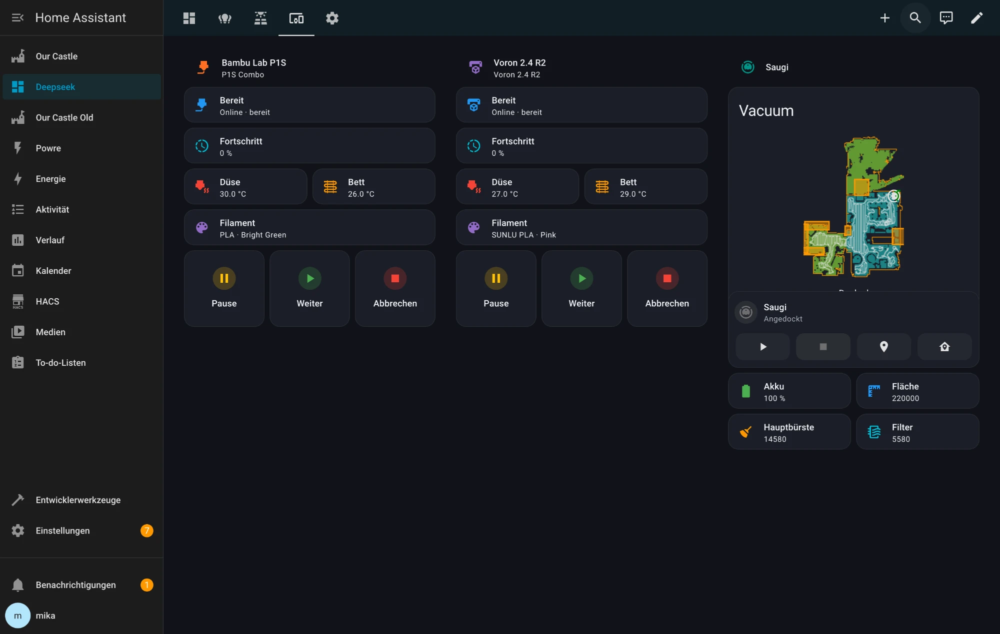
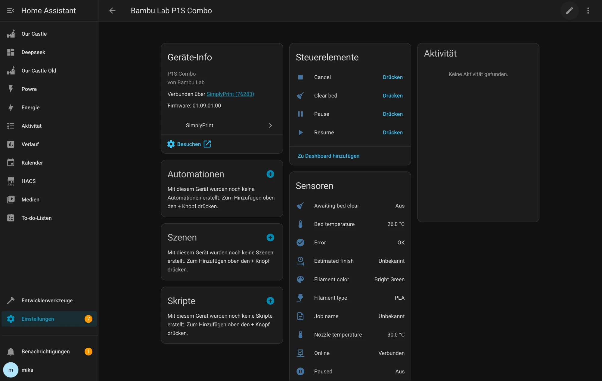
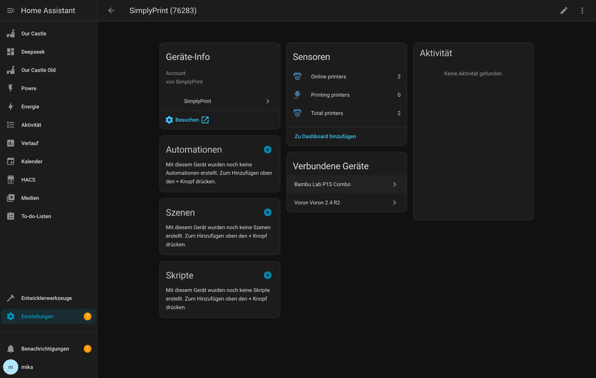

<h1 align="center">🖨️ SimplyPrint for Home Assistant</h1>

<p align="center">
  A fully UI-configurable <a href="https://www.home-assistant.io/">Home Assistant</a> custom integration for
  <a href="https://simplyprint.io/">SimplyPrint</a> — monitor &amp; control every printer on your account,
  with live gcode renders, temperatures, print progress and one-click actions.<br>
  <strong>No YAML editing, no SSH, no file tampering.</strong>
</p>

<p align="center">
  <a href="https://github.com/0x796935/simplyprint-homeassistant/stargazers"></a>
  <a href="https://github.com/0x796935/simplyprint-homeassistant/releases"></a>
  <a href="https://github.com/hacs/integration"></a>
  
  <a href="./LICENSE"></a>
  <a href="https://github.com/0x796935/simplyprint-homeassistant/commits/main"></a>
  <a href="https://github.com/0x796935/simplyprint-homeassistant/issues"></a>
</p>

<p align="center">
  <a href="https://my.home-assistant.io/redirect/hacs_repository/?owner=0x796935&repository=simplyprint-homeassistant&category=integration"></a>
</p>

## Screenshots

<p align="center">
  
</p>

<table>
  <tr>
    <td width="50%"></td>
    <td width="50%"></td>
  </tr>
  <tr>
    <td align="center"><em>Per-printer device — controls &amp; sensors</em></td>
    <td align="center"><em>Account device — fleet totals &amp; linked printers</em></td>
  </tr>
</table>

## Features

- **UI setup** — add the integration, paste your API key + Company ID, done.
- **One device per printer**, plus an **account device** with fleet totals.
- **Live polling** of every printer in a single API call (well within the
  60 requests/min limit). Update interval is adjustable in the options.
- **Re-authentication** flow if your API key is rotated/revoked.
- **Automatic discovery** of printers added to your account later.

### Entities

Per printer (device):

| Type | Entities |
|------|----------|
| Sensor | Status, Progress, Nozzle temp (current/target), Bed temp (current/target), Ambient temp, Job name, Time remaining, Time elapsed, Estimated finish, Layer, Total layers, Filament type/color/remaining, Host CPU/memory, Latency |
| Binary sensor | Online, Printing, Paused, Error, Awaiting bed clear, Filament runout, Out of order, AI failure detection, Camera present |
| Button | Pause, Resume, Cancel, Clear bed |
| Image | **Print render** — the slicer/gcode thumbnail of the file currently printing, with gcode analysis (slicer, total layers, layer height, model size, estimated time) as attributes |

Account (device):

- Total printers, Online printers, Printing printers
- *(optional, Pro plan)* Total print time, Total filament usage, Print job
  count, Successful prints, Failed prints

Some diagnostic/verbose entities are disabled by default — enable them per
entity if you want them.

### Services

| Service | What it does |
|---------|--------------|
| `simplyprint.pause` | Pause the active print |
| `simplyprint.resume` | Resume a paused print |
| `simplyprint.cancel` | Cancel a print (optional reason / comment / return-to-queue) |
| `simplyprint.clear_bed` | Mark the bed cleared (optional success flag + rating) |
| `simplyprint.send_gcode` | Send raw G-code or a named macro (Print Farm plan) |

All services target printer **devices** or **entities** (and areas), so you can
act on several printers at once.

## Installation

### HACS (recommended)

1. In HACS go to **Integrations → ⋮ → Custom repositories**.
2. Add `https://github.com/0x796935/simplyprint-homeassistant` with
   category **Integration**.
3. Install **SimplyPrint**, then restart Home Assistant.

### Manual

Copy `custom_components/simplyprint` into your Home Assistant
`config/custom_components/` directory and restart.

## Configuration

1. **Settings → Devices & Services → Add Integration → SimplyPrint.**
2. Enter:
   - **API key** — create one in the SimplyPrint panel under
     *Account → API* (organisation API key).
   - **Company ID** — the number in your API base URL
     `https://api.simplyprint.io/<Company ID>/`.
3. Adjust the **update interval** and **statistics** options any time via the
   integration's **Configure** button.

## Example automation

Notify when any print finishes and the bed needs clearing:

```yaml
automation:
  - alias: "3D print finished"
    trigger:
      - platform: state
        entity_id: binary_sensor.bambu_lab_p1s_combo_awaiting_bed_clear
        to: "on"
    action:
      - service: notify.mobile_app
        data:
          title: "Print finished 🎉"
          message: "{{ state_attr('sensor.bambu_lab_p1s_combo_job_name','...') }} is done — clear the bed."
```

Pause every printer at once:

```yaml
service: simplyprint.pause
target:
  device_id:
    - <printer-device-1>
    - <printer-device-2>
```

## Notes & limitations

- **Cloud polling** — data is as fresh as the update interval (default 30 s).
- **Statistics** require the SimplyPrint **Pro** plan; **Send G-code** requires
  the **Print Farm** plan. Both degrade gracefully if your plan lacks them.
- **Print render** shows the slicer thumbnail of the active file (resolved via a
  cached file lookup — ~1 extra API call per new print). A live webcam feed is
  not exposed by SimplyPrint's REST API (their camera is WebRTC realtime), so it
  is not included.
- This is an unofficial, community integration and is not affiliated with
  SimplyPrint.

## Credits

Built against the [SimplyPrint public API](https://apidocs.simplyprint.io/).
